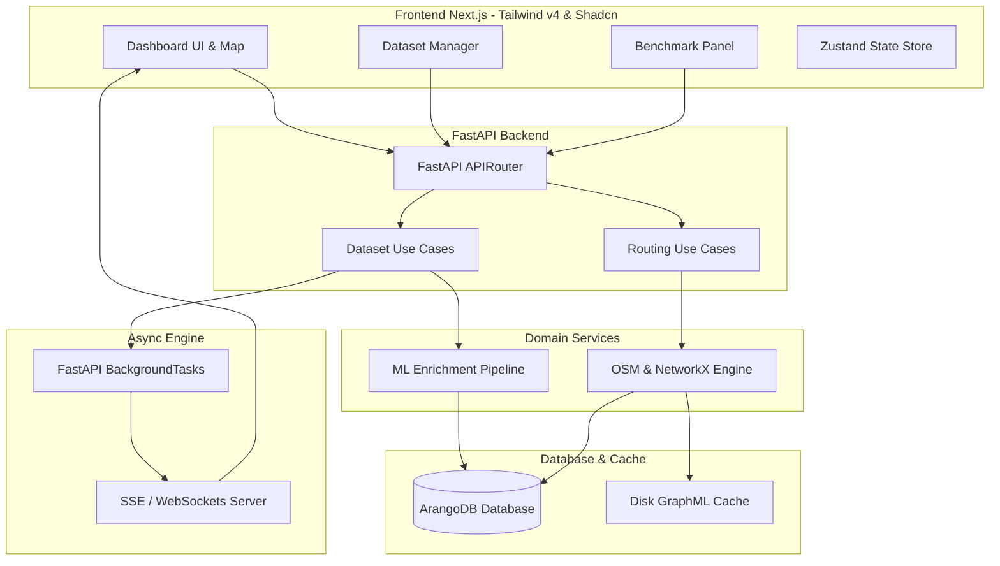

# Product Requirements Document (PRD) - iMosque SafarRoute Modernized
**Versi**: 2.0 (Refactor & Modernization)  
**Status**: Draft  
**Bahasa**: Bahasa Indonesia  

---

## 1. Pendahuluan & Visi Produk

### 1.1. Latar Belakang
Aplikasi **iMosque SafarRoute** dirancang untuk membantu musafir menemukan masjid terbaik di sepanjang rute perjalanan mereka menggunakan pendekatan *multi-objective routing* (waktu tempuh, jarak, kecocokan waktu salat, kapasitas, dan prioritas rekomendasi AI/ML). 

Meskipun sistem prototipe saat ini berhasil mendemonstrasikan integrasi antara algoritma Dijkstra/A*, OpenStreetMap (OSM) via OSMnx, dan AI/ML enrichment, terdapat beberapa keterbatasan teknis dan antarmuka yang menghambat skalabilitas, stabilitas, dan kenyamanan pengguna (*user experience*). Refaktorisasi ini bertujuan untuk memodernisasi aplikasi baik dari sisi backend (kinerja routing, asynchrony, pemanfaatan database graf) maupun frontend (estetika premium, interaktivitas, dan responsivitas).

### 1.2. Visi Produk
Menghasilkan platform navigasi spasial masjid yang responsif, andal, dan memiliki estetika visual premium. Aplikasi ini tidak hanya berfungsi sebagai alat pencarian rute, melainkan juga sebagai dasbor analitik performa algoritma routing dan manajemen dataset spasial yang andal untuk kebutuhan akademis maupun praktis.

---

## 2. Analisis Keterbatasan Sistem Saat Ini & Peluang Modernisasi

| Area | Kondisi Saat Ini (Legacy) | Peluang Modernisasi & Refaktor (Modern) |
| :--- | :--- | :--- |
| **Kinerja & Latensi Routing** | OSMnx mengunduh data jalan dari Overpass API secara sinkronus saat pengguna meminta rute. Area pencarian (*buffer*) yang besar sering kali menyebabkan timeout HTTP (45+ detik) atau kegagalan koneksi. | **Graf Spasial Terdistribusi & Caching Pintar:** Menyimpan sub-graph OSM yang sering diakses di database (ArangoDB `osm_graph_cache`) atau disk. Implementasi fallback otomatis ke OSRM/Valhalla API publik jika Overpass lokal mengalami timeout. |
| **Arsitektur Pemrosesan** | Unggah dataset CSV dan eksekusi ML pipeline berjalan sinkronus. Request HTTP ditahan hingga proses selesai, memicu risiko timeout di frontend untuk dataset berukuran sedang-besar (> 5.000 baris). | **Pemrosesan Asinkronus & Event-Driven:** Memproses unggahan dan ML enrichment di latar belakang (*FastAPI Background Tasks* atau *Celery queue*). Menggunakan *Server-Sent Events (SSE)* atau *WebSockets* untuk mengirimkan progres real-time (0-100%) ke frontend. |
| **Manajemen Database** | Penggunaan ArangoDB belum optimal. Metadata dataset aktif dan profil wilayah masih bergantung pada file JSON lokal (`active_dataset.json` dan folder `processed/`). | **ArangoDB Native Graph & Spatial:** Menghilangkan ketergantungan pada file JSON lokal. Seluruh metadata dataset, status aktif, dan cache koordinat disimpan langsung di ArangoDB. Memanfaatkan *geospatial index* bawaan ArangoDB untuk pencarian radius cepat lintas wilayah secara dinamis. |
| **Antarmuka Pengguna (UI/UX)** | UI menggunakan layout standar Next.js dengan peta Leaflet dasar, kontrol yang padat di sidebar, dan kurangnya visualisasi data analitik untuk benchmark algoritma. | **Estetika Rich & Premium:** Desain modern berbasis *Glassmorphism* (efek blur transparan), tema gelap (*Dark Mode*) yang sinkron dengan peta (CartoDB Dark Matter), visualisasi grafik performa interaktif (Recharts), serta transisi mikro yang halus. |
| **Validasi & Integritas Data** | Validasi koordinat CSV masih sederhana dan tidak memberikan laporan kesalahan terperinci kepada pengguna frontend jika ada baris yang rusak. | **Validasi Data Berperingkat:** Validasi skema CSV yang ketat sebelum pemrosesan ML (misalnya menggunakan *Pandera* atau *Pydantic V2*). Memberikan ringkasan visual kepada pengguna mengenai baris data yang sukses, gagal, atau di luar jangkauan wilayah Indonesia. |

---

## 3. Persyaratan Fungsional (Functional Requirements)

### 3.1. Modul Manajemen Dataset Spasial (Asinkronus & Terpusat)
- **FR-DS-01**: Pengguna dapat mengunggah file CSV masjid melalui antarmuka *drag-and-drop* yang modern.
- **FR-DS-02**: Sistem harus memvalidasi format CSV (kolom wajib: `name`, `latitude`, `longitude`).
- **FR-DS-03**: Sistem harus menampilkan dasbor proses unggahan secara real-time menggunakan progres bar berbasis WebSockets atau SSE (menginformasikan tahap: *Uploading* -> *Validating* -> *ML Enrichment* -> *ArangoDB Ingestion* -> *Completed*).
- **FR-DS-04**: Seluruh dataset yang diunggah disimpan ke dalam koleksi `datasets` di ArangoDB secara terpusat. Status keaktifan dataset dikontrol melalui dokumen konfigurasi di database, bukan file JSON lokal.
- **FR-DS-05**: Pengguna dapat mengaktifkan beberapa dataset sekaligus secara dinamis agar sistem dapat melakukan query spasial lintas batas wilayah (misalnya mencari masjid terdekat di perbatasan Jawa Barat dan Jawa Tengah).
- **FR-DS-06**: Pengguna admin dapat melakukan manajemen CRUD data masjid (tambah manual, edit koordinat/rating, hapus tunggal/massal) secara langsung dari tabel interaktif di frontend.

### 3.2. ML Enrichment Pipeline (Modular & Robust)
- **FR-ML-01**: Pembersihan data koordinat otomatis: koordinat di luar wilayah Indonesia (lintang/bujur terbalik atau di luar batas geografis) akan disaring or ditandai sebagai *invalid*.
- **FR-ML-02**: Model ML (Random Forest untuk estimasi rating dan TF-IDF + Logistic Regression untuk klasifikasi fasilitas) harus dimuat secara efisien (menggunakan pre-trained pickle/joblib) tanpa kebocoran memori.
- **FR-ML-03**: Sistem harus menghasilkan metrik profil data (misal: rasio data kosong yang berhasil diisi, sebaran tier masjid, rata-rata rating) dan menyimpannya di ArangoDB untuk divisualisasikan di frontend.

### 3.3. Navigator Safar Spasial (Multi-Objective Routing)
- **FR-NV-01**: Dasbor utama harus menampilkan peta interaktif yang responsif dengan dukungan tema terang (*Light Mode*) dan gelap (*Dark Mode*). Layer peta harus berganti otomatis menyesuaikan tema aplikasi (misal: *CartoDB Positron* untuk Light Mode, *CartoDB Dark Matter* untuk Dark Mode).
- **FR-NV-02**: Pengguna dapat menentukan lokasi awal (*start*) dan tujuan (*destination*) dengan tiga metode:
  1. Klik langsung pada peta.
  2. Deteksi otomatis GPS perangkat (*Geolocation API*).
  3. Pencarian nama masjid/lokasi menggunakan fitur *Autocomplete Search Box* yang terintegrasi.
- **FR-NV-03**: Sistem harus menampilkan daftar masjid kandidat terdekat di sepanjang koridor perjalanan rute (radius koridor dapat disesuaikan pengguna melalui slider: 1km hingga 15km).
- **FR-NV-04**: Pengguna dapat menyesuaikan parameter pembobotan rute (*Multi-Objective Weights*) melalui slider interaktif di UI (waktu tempuh, jarak, kecocokan waktu salat, kapasitas masjid, dan priority score ML).
- **FR-NV-05**: Peta harus me-render rute jalan turn-by-turn dari lokasi awal ke masjid yang direkomendasikan, kemudian dari masjid tersebut ke tujuan akhir dalam format GeoJSON dengan garis animasi yang mengalir halus (*flowing polyline path*).

### 3.4. Dasbor Analisis Performa & Benchmark Algoritma
- **FR-BM-01**: Sistem harus menyediakan fitur perbandingan langsung (benchmark) antara algoritma **Dijkstra** dan **A*** untuk rute yang sama.
- **FR-BM-02**: Frontend harus menampilkan visualisasi perbandingan performa menggunakan grafik batang/garis interaktif (Recharts) yang mencakup:
  1. Waktu eksekusi (latensi dalam milidetik).
  2. Jumlah node jalan yang dieksplorasi (*explored nodes*).
  3. Estimasi penggunaan memori (KB).
  4. Jarak rute hasil pencarian (memastikan konsistensi keakuratan).
- **FR-BM-03**: Sistem harus menyimpan log performa routing ke database untuk dianalisis secara statistik (misal: rata-rata waktu pencarian rute per radius buffer).

---

## 4. Persyaratan Non-Fungsional (Non-Functional Requirements)

### 4.1. Kinerja & Latensi (Performance)
- **NFR-PF-01**: Waktu pencarian rute (Dijkstra/A*) untuk graph OSM yang sudah ter-cache di database harus selesai dalam waktu kurang dari **800 milidetik**.
- **NFR-PF-02**: Pengunduhan graph OSM baru via Overpass API untuk area buffer di bawah 50 km² harus diselesaikan dalam waktu kurang dari **10 detik** (dengan status progres visual yang jelas kepada pengguna).
- **NFR-PF-03**: Peta harus mampu me-render hingga **3.000 penanda masjid (markers)** secara bersamaan tanpa lag atau penurunan frame rate di bawah 60 FPS menggunakan teknik *marker clustering* atau virtual canvas rendering.

### 4.2. Estetika Desain & UX (Aesthetics & UX)
- **NFR-UX-01**: UI wajib menggunakan pendekatan estetika modern premium: efek *glassmorphism* (backdrop-filter blur), warna aksen yang harmonis (emerald/mint untuk tema islami, disandingkan dengan abu-abu gelap/hitam premium pada mode gelap), serta bayangan lembut (*soft shadows*).
- **NFR-UX-02**: Tipografi harus menggunakan font modern seperti *Inter*, *Outfit*, atau *Plus Jakarta Sans* yang diambil dari Google Fonts.
- **NFR-UX-03**: Sistem harus merespons perubahan ukuran layar (responsive design) mulai dari perangkat mobile (lebar 360px) hingga desktop ultra-wide. Di perangkat mobile, sidebar harus bertransformasi menjadi laci bawah (*bottom drawer*) yang dapat ditarik (*collapsible*).
- **NFR-UX-04**: Setiap aksi penting (sukses upload, rute ditemukan, ganti dataset) harus disertai dengan animasi mikro (fade-in, slide, hover transition) dan notifikasi toast yang informatif (sonner).

### 4.3. Keandalan & Toleransi Kesalahan (Reliability & Fault Tolerance)
- **NFR-RL-01**: Jika koneksi Overpass API mati atau timeout, sistem harus secara otomatis beralih menggunakan data sub-graph lokal terdekat yang tersimpan di ArangoDB sebagai fallback.
- **NFR-RL-02**: Jika koordinat start/end berada di tengah laut atau di luar jangkauan graph jalan, sistem harus memberikan pesan kesalahan yang bersahabat (*friendly error message*) dan menyarankan pengguna untuk memindahkan pin rute ke jalan terdekat.

---

## 5. Rencana Arsitektur Refaktorisasi

### 5.1. Rincian Refaktorisasi Kode Backend
1. **Pemisahan Logika Data & Cache**: Pindahkan seluruh file pembantu ke database ArangoDB (koleksi `datasets` dan `osm_graph_cache`). Hapus ketergantungan pada file JSON disk dinamis.
2. **Implementasi Dependency Injection (DI)**: Gunakan dependency injection bawaan FastAPI untuk menyuntikkan repositori (`ArangoMosqueRepository`, `ArangoDatasetRepository`) ke dalam use cases, memudahkan penulisan *unit test*.
3. **Penyempurnaan Algoritma Spasial ArangoDB**: Terapkan query AQL dengan filter `GEO_CONTAINS` atau `GEO_DISTANCE` untuk pencarian masjid kandidat tercepat, menggantikan pemfilteran manual berbasis perulangan Python.

### 5.2. Rincian Refaktorisasi Kode Frontend
1. **Redesain Total UI/UX**: Terapkan tema gelap bawaan, ganti komponen card standar dengan efek glassmorphism, dan rapikan tata letak agar peta Leaflet memenuhi layar dengan panel kontrol melayang (*floating panels*).
2. **Optimasi Rendering Peta**: Terapkan dynamic importing untuk Leaflet untuk mencegah kegagalan Server-Side Rendering (SSR). Terapkan *marker clustering* untuk menangani ribuan masjid tanpa penurunan performa.
3. **Pemberitahuan Progres Unggahan**: Hubungkan frontend dengan endpoint SSE (`/api/v1/datasets/upload/progress`) agar pengguna dapat melihat dengan jelas proses validasi dan enrichment baris demi baris.

---

## 6. Rencana Verifikasi & Pengujian (Verification Plan)

### 6.1. Pengujian Fungsional & Integrasi
- **Pengujian Upload**: Mengunggah CSV berisi 10.000 masjid. Memastikan progres bar berjalan lancar dari 0% ke 100% dan data tersimpan dengan benar di ArangoDB.
- **Pengujian Multi-Objective**: Mengubah bobot prioritas shalat menjadi 100% dan memverifikasi bahwa rute Dijkstra menyimpang ke masjid terdekat yang memiliki kecocokan waktu salat terbaik, meskipun jaraknya lebih jauh dari rute terpendek biasa.
- **Pengujian Benchmark**: Menjalankan benchmark rute sejauh 20km dan memverifikasi visualisasi perbandingan algoritma ter-render dengan benar menggunakan Recharts di frontend.

### 6.2. Pengujian Non-Fungsional
- **Pengujian Latensi**: Menjalankan 100 request routing berturut-turut pada graph ter-cache dan mengukur rata-rata response time (harus di bawah 800ms).
- **Pengujian Responsivitas**: Membuka dashboard menggunakan emulator perangkat mobile (iPhone 12/Pixel 5) dan memastikan antarmuka laci bawah (*bottom drawer*) dapat digunakan dengan nyaman dan tidak menutupi informasi penting pada peta.
